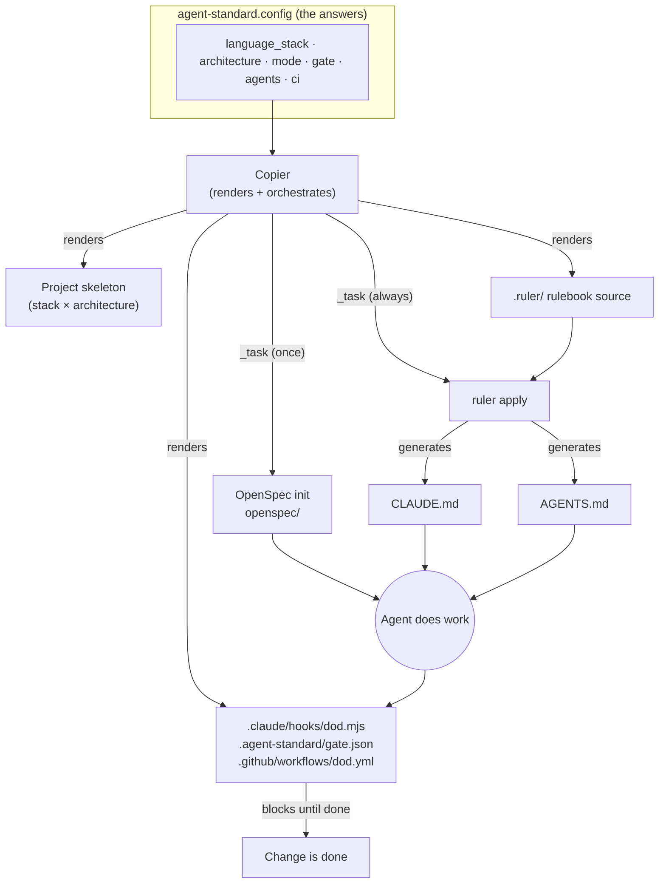
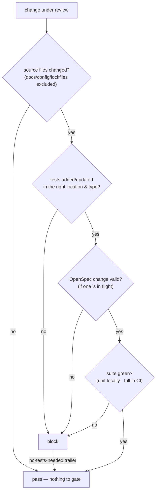
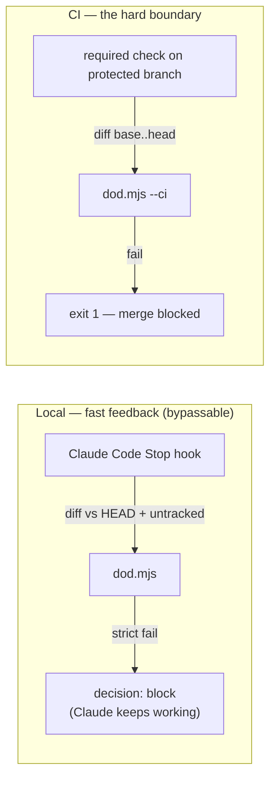

# Architecture

How agent-standard is built and how the pieces interact. This is an engineering
document, not a pitch — it describes the real wiring, file ownership, and control flow.

## The idea

agent-standard is **not** a monolith that reimplements planning, docs, and scaffolding.
It is a thin **integration spine**: one configuration selects a stack and architecture,
and Copier composes three mature tools plus one purpose-built gate into a repository that
has a consistent, *enforced* process for agent-driven development.

| Concern | Tool | Build or adopt |
|---|---|---|
| Delivery, scaffolding, staying up to date | **Copier** | adopt |
| Planning process (spec → plan → tasks) | **OpenSpec** | adopt |
| One rulebook across every agent tool | **ruler** | adopt |
| **Definition-of-done enforcement** | **custom gate** (`dod.mjs`) | **build** — nothing off-the-shelf does this |

## Composition

The configuration is the product surface. Everything downstream — which skeleton, which
gate globs, which agents get a rulebook, whether CI is emitted — is derived from it.

## File ownership (the seam map)

Each tool owns a disjoint set of paths, so they compose without clobbering each other.
This is the rule that keeps `copier update` safe.

| Path | Owner | Notes |
|---|---|---|
| skeleton (`src/`, `app/`, configs), gated by answers | **Copier template** | rendered only in `greenfield` mode |
| `.copier-answers.yml` | Copier | records answers; never hand-edit |
| `.ruler/**` | **Copier template** | the rulebook **source** — three conditionally-rendered modules: `00-operating` (shared loop + DoD), `10-<language>` (language/framework standards), `20-<architecture>` (architecture standards, concretized to the language). Only the modules matching `language_stack`/`architecture` render, so the rulebook is never agnostic. |
| `CLAUDE.md`, `AGENTS.md` | **ruler** (generated) | Copier is told to **exclude** these — rendering them would clobber ruler on update |
| `openspec/`, `.claude/skills/openspec-*`, `.claude/commands/opsx/` | **OpenSpec** | created by `init`, upgraded by `update` |
| `.claude/settings.json`, `.claude/hooks/dod.mjs` | **the gate** | committed hook config |
| `.github/workflows/dod.yml` | **the gate** | the required CI check |
| `.gitignore` | shared | the template writes it; ruler appends its own managed block |

`.claude/` and `.github/` are **co-owned** (OpenSpec skills + gate files), so the template
never renders those whole directories — only specific files inside them.

## The definition-of-done gate

The gate is the one thing built from scratch, because nothing verifies "the agent wrote
tests, in the right place, of the right type, and they pass" as a completion condition.
One script runs in two places so their verdicts always agree:

**Two entry points, one script (`.claude/hooks/dod.mjs`):**

The local hook is deliberately fast (unit tests only) and is bypassable
(`disableAllHooks`, workspace-trust). The **required CI check runs the full suite and is
the real enforcement** — the hook is matching fast feedback so problems surface before CI.
The gate passes trivially when there is nothing to check (clean tree, docs-only change, a
freshly rendered repo), so it never nags mid-conversation.

## How a configuration flows through — worked example

`language_stack: py-fastapi`, `architecture: clean-layered`, `mode: greenfield`,
`gate: strict`, `agents: [claude, codex]`, `ci: true`:

1. **Copier** renders the Python clean-layered skeleton (`src/<pkg>/domain|application|adapters`, `tests/unit`, `tests/integration`), `pyproject.toml`, `ARCHITECTURE.md`, the `.ruler/` rulebook, the gate files, and the CI workflow (because `ci: true`).
2. `_task` runs `openspec init --tools claude,codex` → `openspec/` + Claude/Codex skills.
3. `_task` runs `ruler apply --agents claude,codex` → generates `CLAUDE.md` + `AGENTS.md` from `.ruler/`.
4. `.agent-standard/gate.json` gets the Python globs and `uv run pytest` commands, `mode: strict`.
5. From then on: every change goes spec → plan → build, and cannot be called done until a test exists under `tests/unit` or `tests/integration` and `uv run pytest` is green — enforced locally by the stop hook and required in CI.

## Runtimes and constraints

- **Two runtimes on the developer machine:** Python + Git (for Copier) and Node ≥20 (for
  OpenSpec, ruler, and the gate). The `bootstrap` step checks both.
- Copier `_tasks` execute shell commands, so `copier copy`/`update` require **`--trust`**.
- ruler is pre-1.0 and OpenSpec's layout evolves — the tool versions are **pinned** in
  `copier.yml` and re-verified on bump.
- The composition is intentionally swappable: the process engine (OpenSpec) sits behind a
  file convention, so it can be replaced without touching the gate or the skeletons.
