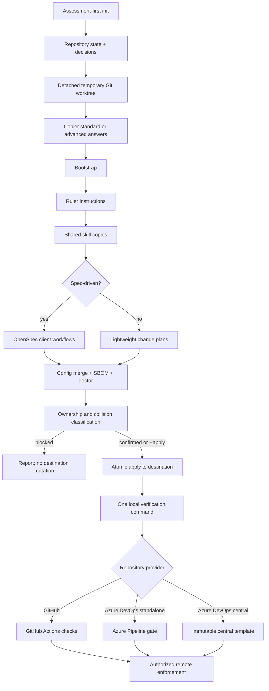

# Architecture

agent-standard is a conformance contract with a reference generator. The v1 CLI is an assessment-and-apply boundary; Copier remains the versioned rendering and update engine underneath it. The [canonical diagram set](diagrams.md) provides the visual overview for architecture, operations, and business stakeholders.

Running Ruler without skill ownership, synchronizing the standard skills, and initializing OpenSpec last prevents one generator from erasing another generator’s client artifacts.

The product and schema versions are separate contracts. `package.json` is the canonical product version; `manifest.schema.json` remains schema version 1 until an incompatible manifest shape requires migration. Every rendered manifest also records the full immutable source revision, or `development` only when mutable/local development was explicitly selected.

## Ownership seams

| Path | Owner | Contract |
|---|---|---|
| application skeleton and configs | Copier | Rendered only for greenfield projects |
| existing README/security/docs/config | repository team | Preserved on initial adoption |
| `.agent-standard/copier-answers.yml` | Copier | Namespaced update inputs; do not hand-edit casually |
| `.ruler/**` | agent-standard/Ruler | Canonical rules and standard skills |
| `AGENTS.md`, `CLAUDE.md` | Ruler | Generated, tracked, and reviewed |
| `.claude/skills/**`, `.agents/skills/**`, `.github/skills/**` | standard skill sync | Generated, tracked client discovery surfaces |
| `openspec/**` and OpenSpec client artifacts | OpenSpec | Present only in the spec-driven profile |
| `.agent-standard/**` | agent-standard | Manifest, schema, configuration merge, gates, waivers, verification, and SBOM tooling |
| managed provider review block and Claude hook | merge script | Idempotent additions that preserve surrounding project configuration |
| `.github/CODEOWNERS`, Dependabot, PR template, workflows | GitHub adapter | Emitted only for GitHub repositories |
| `.agent-standard/platforms/azure-devops.json`, `.azuredevops/`, `azure-pipelines.yml` | Azure DevOps adapter | Emitted only for Azure DevOps repositories; standalone or immutable central-template entry point |
| `modules/azure-devops/**` | agent-standard/platform team | Reference enterprise extending template; vendored into a protected organization repository, never rendered into applications |
| GitHub rulesets or Azure Repos policies/security settings | authorized repository administrators | External state; never mutated by the template |

Initial adoption is fail-closed at these seams. Existing `.agent-standard/`, `.ruler/`, root or nested agent instruction files, same-named client skills, and existing OpenSpec artifacts are not treated as an architecture profile or silently migrated. A differing selected output path is an unowned collision unless it is one of the narrow validated managed merges. Direct Copier copy is therefore a maintainer/development interface; supported team adoption goes through `agent-standard init`, while Copier remains the supported update interface after installation.

Immediately before application, the CLI rechecks HEAD, clean worktree state, collision-sensitive path fingerprints, and ownership rules. A copy failure restores backups and removes partial new paths. A successful apply is recovered through Git from the required clean starting commit; v1 does not claim transactional post-success updates.

## Architecture axes

`architecture` controls dependency direction inside a deployable unit. `topology` controls how many units deploy and communicate. Greenfield projects receive boundary notes and a matching skeleton; adoption keeps existing code and records the intended mapping without forcing a reorganization.

## Enforcement flow

The Claude Stop hook is fast local feedback and is bypassable by design. CI is the enforceable repository boundary only after its job is required by a GitHub ruleset or Azure Repos Build Validation policy.

1. `doctor.mjs` checks required tracked files, skill frontmatter and propagation, workflow artifacts, governed-document metadata and links, the declared toolchain, and SBOM identities.
2. `verify.mjs` runs the doctor and the complete stack-native lint/type/test/build command once.
3. `dod.mjs` checks the changed-file policy: source changes need a recognized test or an owned, expiring waiver; active OpenSpec work must validate.
4. CI runs full verification followed by policy-only DoD evaluation, avoiding duplicate test execution.
5. Provider-native dependency/code scanning and published SBOM artifacts add supply-chain evidence.
6. Separately administered repository policy turns passing jobs into mandatory merge controls; the Azure adapter can audit that state without mutating it.

## Update behavior

`copier update --trust --answers-file .agent-standard/copier-answers.yml --vcs-ref <FULL_SHA> --data standard_revision=<FULL_SHA>` re-renders owned files from an immutable revision, regenerates rulebooks and standard skills, refreshes the selected workflow integration, merges managed configuration, and refreshes the SBOM. Teams reinstall when dependency manifests change, run the one verification command, review the entire generated diff, and commit the update together.

## V1 compatibility boundary

Stable v1 interfaces are documented CLI flags and exit meanings, Copier answer names/values, manifest schema, control IDs, and the ownership seams above. Exact generated prose and file contents, console wording, and internal helper structure are implementation details and may evolve in compatible releases.
