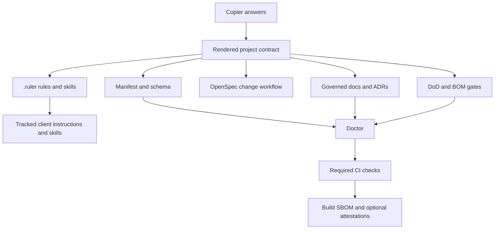

# Architecture

agent-standard is a versioned conformance specification with a reference generator. Its public API is the Copier answer model; its output is a repository contract that humans, agents, and CI can all inspect.

## Ownership seams

| Path | Owner | Contract |
|---|---|---|
| application skeleton and configs | Copier | Rendered only for greenfield projects |
| `.copier-answers.yml` | Copier | Recorded update inputs; do not hand-edit |
| `.ruler/**` | agent-standard/Ruler | Canonical rules and skills |
| `AGENTS.md`, `CLAUDE.md`, client skill directories | Ruler | Generated but intentionally committed and reviewed |
| `openspec/**`, OpenSpec client skills | OpenSpec | Initialized or updated by the pinned CLI |
| `.agent-standard/**` | agent-standard | Manifest, schema, gate configuration, waivers, doctor, and SBOM tooling |
| `docs/**`, `SECURITY.md`, `CONTRIBUTING.md` | repository maintainers | Governed documentation kernel |
| `.github/**` | agent-standard plus maintainers | CI baseline; repositories may add stricter jobs |

Ruler runs with `--gitignore=false`, so generated client artifacts survive a fresh clone. Canonical edits still happen in `.ruler/`; CI and review detect missing generated surfaces.

## Two orthogonal architecture axes

`architecture` controls dependency direction inside a deployable unit. `topology` controls how many units deploy and communicate. A clean-layered modular monolith and a clean-layered distributed service are both coherent configurations; making these choices independent removes the previous false either/or.

Greenfield projects receive actual architecture directories with boundary notes. Adoption mode keeps existing code but still creates the manifest and documentation contracts so teams can map current paths deliberately.

## Enforcement flow

The local Claude Stop hook is fast feedback and remains bypassable by design. CI is the hard boundary.

1. The doctor checks the manifest, required tracked files, skill frontmatter, local documentation links, and selected SBOM identities.
2. The DoD gate compares event SHAs using argument-safe Git execution.
3. Source changes require a recognised test or an owned, reasoned, unexpired path waiver.
4. Active OpenSpec changes validate with the pinned CLI.
5. CI executes the stack's lint, type, test, and build contract.
6. A pinned Syft action emits a build SBOM in the selected format(s).

Advisory mode reports the same findings and returns success both locally and in CI. Strict mode blocks locally and exits non-zero in CI.

## Update behavior

`copier update --trust` re-renders owned files, updates OpenSpec, regenerates Ruler outputs and client skills, and refreshes the SBOM. Teams then reinstall dependencies if manifests changed, regenerate the SBOM from the final lockfile, run the doctor, review all generated diffs, and commit them together.
