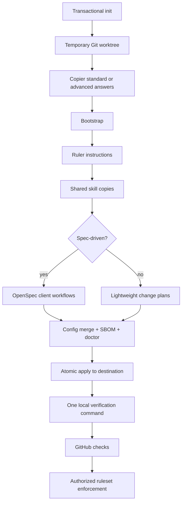

# Architecture

agent-standard is a conformance contract with a reference generator. The recommended CLI narrows the setup surface and adds transaction safety; Copier remains the versioned rendering engine underneath it.

Running Ruler without skill ownership, synchronizing the standard skills, and initializing OpenSpec last prevents one generator from erasing another generator’s client artifacts.

## Ownership seams

| Path | Owner | Contract |
|---|---|---|
| application skeleton and configs | Copier | Rendered only for greenfield projects |
| existing README/security/docs/config | repository team | Preserved on initial adoption |
| `.agent-standard/copier-answers.yml` | Copier | Namespaced update inputs; do not hand-edit casually |
| `.ruler/**` | agent-standard/Ruler | Canonical rules and standard skills |
| `AGENTS.md`, `CLAUDE.md` | Ruler | Generated, tracked, and reviewed |
| `.claude/skills/**`, `.agents/skills/**`, `.github/skills/**` | standard skill sync | Generated, tracked client discovery surfaces |
| `openspec/**` and OpenSpec client artifacts | OpenSpec | Present only in the spec-driven profile |
| `.agent-standard/**` | agent-standard | Manifest, schema, configuration merge, gates, waivers, verification, and SBOM tooling |
| managed CODEOWNERS block and Claude hook | merge script | Idempotent additions that preserve surrounding project configuration |
| GitHub rulesets/settings | authorized repository administrators | External state; never mutated by the template |

## Architecture axes

`architecture` controls dependency direction inside a deployable unit. `topology` controls how many units deploy and communicate. Greenfield projects receive boundary notes and a matching skeleton; adoption keeps existing code and records the intended mapping without forcing a reorganization.

## Enforcement flow

The Claude Stop hook is fast local feedback and is bypassable by design. CI is the enforceable repository boundary only after its job is required by a ruleset.

1. `doctor.mjs` checks required tracked files, skill frontmatter and propagation, workflow artifacts, governed-document metadata and links, the declared toolchain, and SBOM identities.
2. `verify.mjs` runs the doctor and the complete stack-native lint/type/test/build command once.
3. `dod.mjs` checks the changed-file policy: source changes need a recognized test or an owned, expiring waiver; active OpenSpec work must validate.
4. CI runs full verification followed by policy-only DoD evaluation, avoiding duplicate test execution.
5. Dependency review, CodeQL, and build SBOM jobs add supply-chain evidence.
6. A separately administered ruleset turns passing jobs into mandatory merge controls.

## Update behavior

`copier update --trust --answers-file .agent-standard/copier-answers.yml` re-renders owned files, regenerates rulebooks and standard skills, refreshes the selected workflow integration, merges managed configuration, and refreshes the SBOM. Teams reinstall when dependency manifests change, run the one verification command, review the entire generated diff, and commit the update together.
