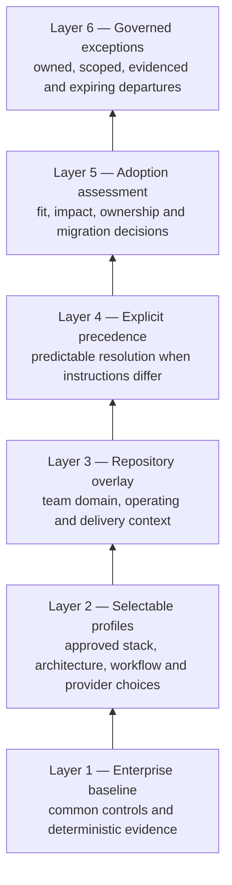
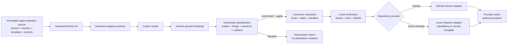
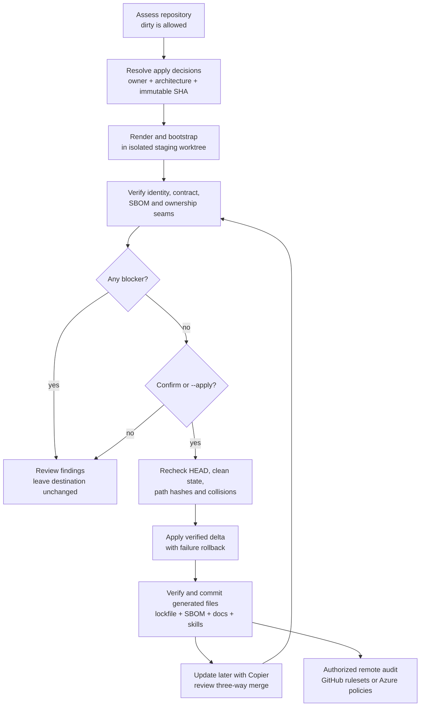
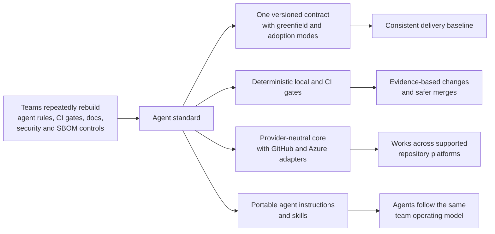

# Agent standard diagrams

These diagrams are the reviewable visual summary of the standard. The architecture and runbook documents remain the normative sources for implementation and procedure; this page keeps the visual explanations together and links them from the source index.

## Six-layer enterprise architecture

The layers form one control system. The baseline creates consistency; profiles and overlays add approved context; precedence keeps outcomes predictable; assessment makes adoption evidence-based; governed exceptions provide bounded flexibility.

## How the standard works

The generator owns the rendered contract and provider control files. Repository administrators own the remote settings that make passing checks mandatory.

## Adoption and update runbook

## Business explanation

The standard reduces duplicated setup while leaving application architecture, deployment topology, and remote policy ownership explicit. It improves repeatability and audit evidence; it does not reorganize an adopted application or silently change repository settings.
